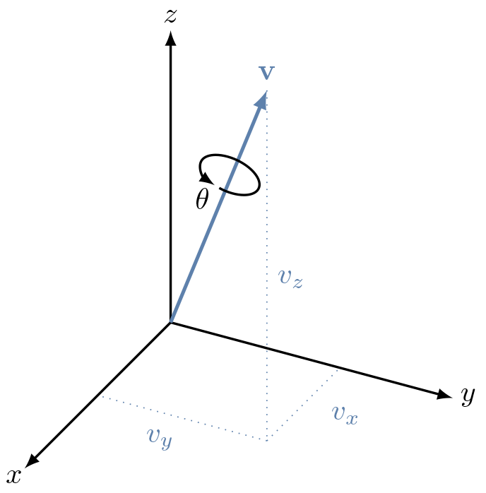

# Quaternion rotation
Status: draft

Quaternions are hypercomplex numbers with the form 

$$\mathbf{q} = q_0 + q_1\mathbf{i} + q_2\mathbf{j} + q_3\mathbf{k}$$

where $q_0$ is referred to as the *scalar* or *real* component and $q_1\mathbf{i} + q_2\mathbf{j} + q_3\mathbf{k}$ is the *vector* or *imaginary* component. Despite their apparent complexity, quaternions provide a simple and robust mechanism for representing rotations in 3D space. 

It is easier to understand *rotation quaternions* after first understanding the [axis-angle representation](https://en.wikipedia.org/wiki/Axis–angle_representation) of 3D rotations. In the axis-angle formalism, rotations are specified by a unit vector $\mathbf{v} = v_x\mathbf{i} + v_y\mathbf{j} + v_z\mathbf{k}$ defining the axis of rotation and the angle of rotation $\theta$. 

Although the axis-angle representation adequately describes 3D rotations, using quaternions instead proves to be far simpler and more numerically efficient. Unfortunately quaternions are a difficult concept to grasp. Mercifully a deep understanding is not required to use them for 3D rotations. Grasping the basics will suffice. 

This means that given an axis-angle rotation, an equivalent rotation quaternion is

$$q_0 = \cos\left(\frac{\theta}{2}\right)$$
$$q_1 = v_x \sin\left(\frac{\theta}{2}\right)$$
$$q_2 = v_y \sin\left(\frac{\theta}{2}\right)$$
$$q_3 = v_z \sin\left(\frac{\theta}{2}\right)$$

https://danceswithcode.net/engineeringnotes/quaternions/quaternions.html